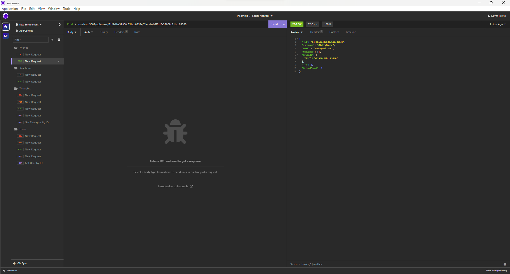
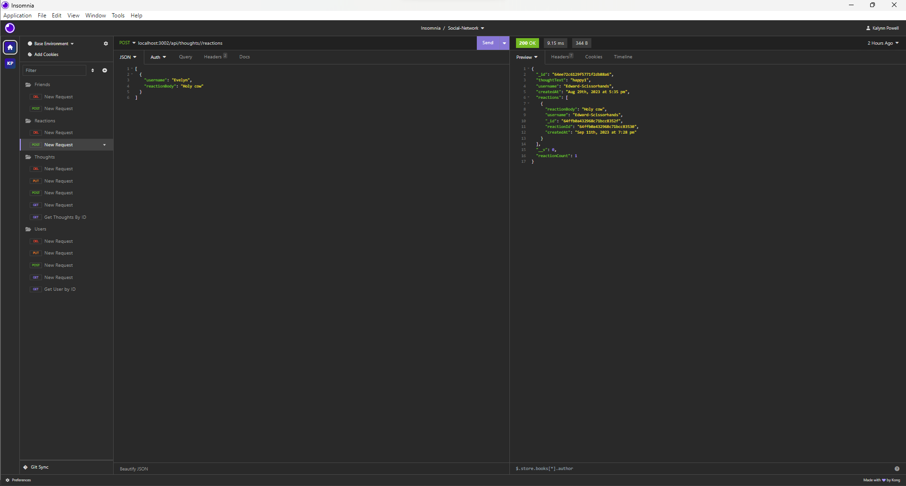
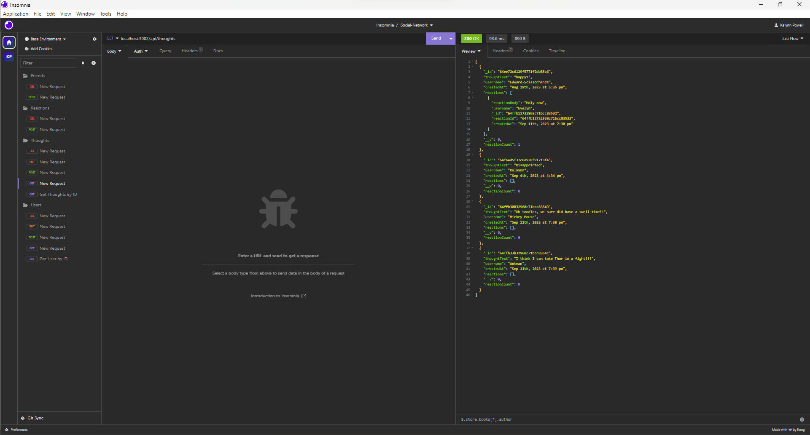
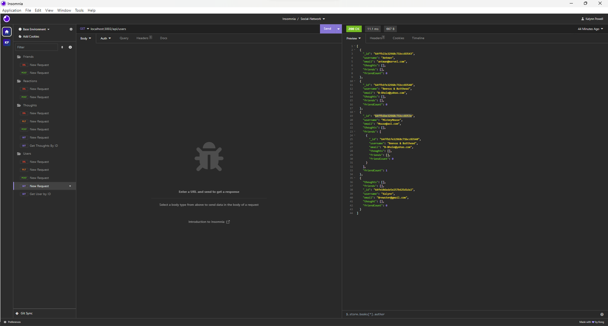

# Social-Network
Social Networking App

## User Story

AS A social media startup
I WANT an API for my social network that uses a NoSQL database
SO THAT my website can handle large amounts of unstructured data

## Acceptance Criteria

GIVEN a social network API
WHEN I enter the command to invoke the application
THEN my server is started and the Mongoose models are synced to the MongoDB database
WHEN I open API GET routes in Insomnia for users and thoughts
THEN the data for each of these routes is displayed in a formatted JSON
WHEN I test API POST, PUT, and DELETE routes in Insomnia
THEN I am able to successfully create, update, and delete users and thoughts in my database
WHEN I test API POST and DELETE routes in Insomnia
THEN I am able to successfully create and delete reactions to thoughts and add and remove friends to a user’s friend list

## Description

This is a RESTful API back-end for a social network application using MongoDB as the NoSQL database along with Mongoose as the ODM. Node.js is used with Express.js for the server and Day.js is used for formatting date and time. There is currently no front-end functionality for this app so routes are demonstrated with screenshots and a demo video below.

## Installation

Clone the repo: git clone `git@github.com:kmarie0420/Social-Network.git`

1. Open in VS Code. If you do not have VS code you must install it.

2. Using the terminal, install node.js.

3. Once node.js is installed, in the terminal, utilize the command npm init -y to initialize and create a package.json where project files will be stored.

4. Next, use the terminal to run the command npm i to install the dependencies associated with this application (developers may need to install dependencies directly from the command line).

5. Commands to install each dependency:

 *Command for express will be `npm i express`
 *Command for mongoose will be `npm i mongoose`
 *Command for nodemon will be `npm i nodemon`
 *Command for jest will be `npm i jest`

6. Next, you will want to make sure you have access to a MongoDB account and MongoDB Compass, these will allow you to interact with the database and visually confirm what changes are being made in the database. (Link for MongoDB & MongoDB Compass download -> https://coding-boot-camp.github.io/full-stack/mongodb/how-to-install-mongodb).

7. Once all dependencies are installed, you will then be able to run the command npm start from the root directory to spin up the server. With nodemon installed, you will also be able to utilize the command npm run dev to keep the server spun up between code edits.

8. From there, you can utilize applications such as Insomnia to test the functionality of the API routes within the program and make edits to the code base (Link to install Insomnia -> https://docs.insomnia.rest/insomnia/install).

## Usage Information

As of now the usage of this application can be conducted through spinning up the server with npm run start, then heading over to an application like Insomnia and testing different API end points. For further information on starting up the server, MongoDB Compass and MongoDB installation navigate to the Installation section above.

## Screenshots

*
*
*
*

## Contributors

Kalynn Powell

## License

## Github Repository

https://github.com/kmarie0420/Social-Network

## Walk-Through Video

[Users Video](https://drive.google.com/file/d/1EvaoVqP1zZEocBoTsNDQFU-hFNxDTXcW/view)
[Thoughts Video](https://drive.google.com/file/d/1b5mx9FjCJARVnHlnH1jBaDm-oS2MjFnr/view)
[Reactions Video](https://drive.google.com/file/d/1xLIIphbmiuVM94rM-9tcnyt7EG_o-nkI/view)
[Friends Video](https://drive.google.com/file/d/1ipw_bBk97dMcsGJNv0_JK0-bNki6y-FZ/view)

## Questions

If you have any questions or concerns, please email:
 Kalynn Powell - kpowell0420@gmail.com or [Github](https://github.com/kmarie0420) 

